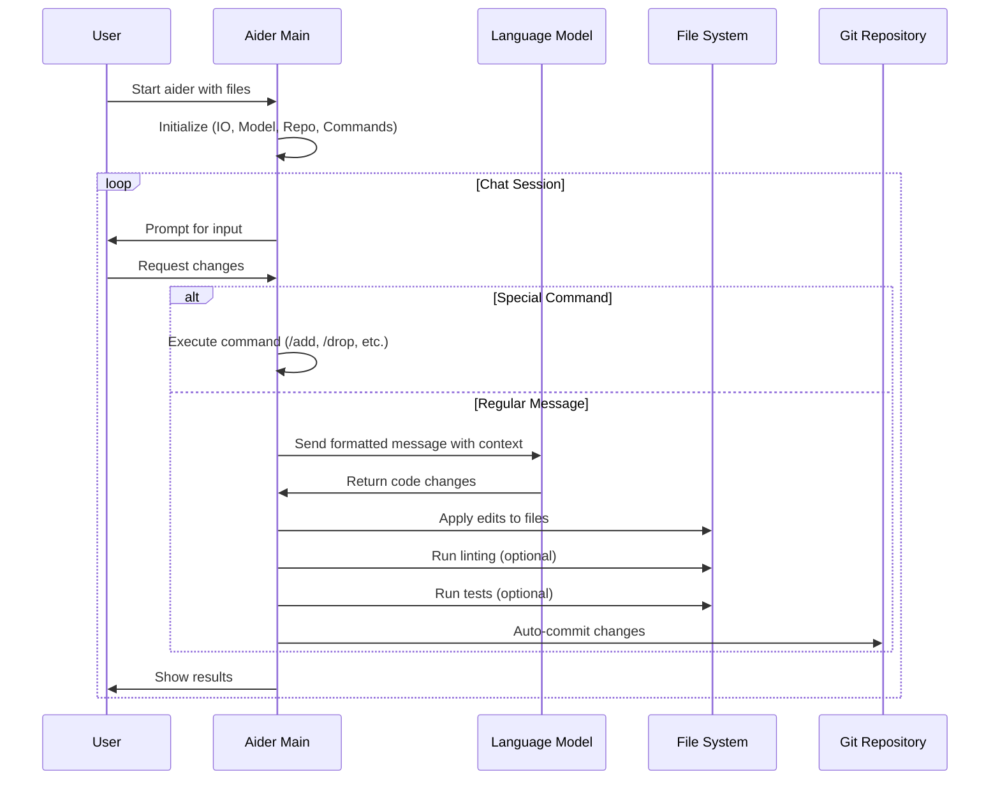

# Aider Architecture Flow

This document provides a comprehensive overview of how Aider processes user requests from input to output, including all major paths, error handling, and alternate flows.

## Overview

Aider follows a sophisticated flow that involves multiple components working together to process user input, interact with LLMs, apply code changes, and handle various scenarios including errors, linting, testing, and git operations.

## High-Level Flow Overview

Here's a simplified view of the main flow:



## Complete Process Flow Diagram

The following detailed sequence diagram shows the entire process from user prompt to result, including all major paths and error handling:

```mermaid
sequenceDiagram
    participant User
    participant Main as main.py
    participant IO as InputOutput
    participant Coder as Coder (Base)
    participant Commands as Commands
    participant Model as Model
    participant LLM as LiteLLM/Provider
    participant Linter as Linter
    participant Repo as GitRepo
    participant FileSystem as File System

    %% Application Startup
    User->>Main: aider [args]
    Main->>Main: parse_args()
    Main->>IO: InputOutput()
    Main->>Model: Model(args.model)
    Main->>Repo: GitRepo()
    Main->>Commands: Commands()
    Main->>Coder: Coder.create()
    
    %% Main Loop Start
    loop Main Chat Loop
        Main->>Coder: coder.run()
        
        %% Input Processing
        Coder->>IO: get_input()
        IO->>User: prompt for input
        User->>IO: user message
        IO->>Coder: user_message
        
        %% Command Check
        Coder->>Coder: preproc_user_input()
        alt Is Command
            Coder->>Commands: is_command()
            Commands->>Commands: run()
            Commands-->>Coder: command result
        else Regular Message
            %% Message Processing
            Coder->>Coder: run_one()
            Coder->>Coder: init_before_message()
            
            %% Reflection Loop
            loop Reflection Loop (max 3)
                Coder->>Coder: send_message()
                
                %% Format Messages
                Coder->>Coder: format_messages()
                Coder->>Coder: check_tokens()
                
                %% LLM Interaction
                Coder->>Model: send_completion()
                Model->>LLM: litellm.completion()
                
                alt Success
                    LLM-->>Model: response
                    Model-->>Coder: completion
                    
                    alt Streaming
                        Coder->>IO: show_send_output_stream()
                        loop Stream Chunks
                            IO->>User: display chunk
                        end
                    else Non-Streaming
                        Coder->>IO: show_send_output()
                        IO->>User: display response
                    end
                    
                else LLM Error
                    LLM-->>Model: error
                    Model-->>Coder: exception
                    
                    alt Retryable Error
                        Coder->>Coder: retry with backoff
                    else Non-Retryable Error
                        Coder->>IO: tool_error()
                        IO->>User: error message
                        break
                    end
                end
                
                %% Apply Updates
                Coder->>Coder: apply_updates()
                
                alt Has Edits
                    Coder->>Coder: get_edits()
                    
                    alt Edit Format Error
                        Coder->>IO: tool_error()
                        Coder->>Coder: set reflected_message
                        continue
                    else Valid Edits
                        Coder->>Coder: apply_edits_dry_run()
                        Coder->>Coder: prepare_to_edit()
                        Coder->>FileSystem: apply_edits()
                        FileSystem-->>Coder: edited files
                        
                        %% Auto Commit
                        alt Auto Commits Enabled
                            Coder->>Repo: auto_commit()
                            Repo->>Repo: commit()
                            Repo-->>Coder: commit hash
                        end
                        
                        %% Auto Lint
                        alt Auto Lint Enabled
                            Coder->>Linter: lint_edited()
                            Linter->>FileSystem: read files
                            Linter->>Linter: run_lint_commands()
                            Linter-->>Coder: lint_errors
                            
                            alt Has Lint Errors
                                Coder->>IO: confirm_ask("Fix lint errors?")
                                IO->>User: prompt
                                User->>IO: response
                                IO-->>Coder: user_choice
                                
                                alt User Confirms
                                    Coder->>Coder: set reflected_message
                                    continue
                                end
                            end
                        end
                        
                        %% Shell Commands
                        alt Has Shell Commands
                            Coder->>Coder: run_shell_commands()
                            Coder->>FileSystem: execute commands
                            FileSystem-->>Coder: command output
                            
                            alt Add Output to Chat
                                Coder->>IO: confirm_ask("Add output?")
                                IO->>User: prompt
                                User->>IO: response
                                IO-->>Coder: user_choice
                            end
                        end
                        
                        %% Auto Test
                        alt Auto Test Enabled
                            Coder->>Commands: cmd_test()
                            Commands->>FileSystem: run test command
                            FileSystem-->>Commands: test_results
                            Commands-->>Coder: test_errors
                            
                            alt Has Test Errors
                                Coder->>IO: confirm_ask("Fix test errors?")
                                IO->>User: prompt
                                User->>IO: response
                                IO-->>Coder: user_choice
                                
                                alt User Confirms
                                    Coder->>Coder: set reflected_message
                                    continue
                                end
                            end
                        end
                    end
                end
                
                %% Check for Reflection
                alt Has Reflected Message
                    continue
                else No Reflection Needed
                    break
                end
            end
        end
        
        %% Error Handling
        alt Keyboard Interrupt
            User->>Coder: Ctrl+C
            Coder->>Coder: keyboard_interrupt()
            
            alt Double Ctrl+C
                Coder->>Main: sys.exit()
            else Single Ctrl+C
                Coder->>IO: tool_warning("^C again to exit")
                continue
            end
        end
        
        %% Context Window Exhausted
        alt Context Window Exceeded
            Coder->>Coder: handle_context_exhausted()
            Coder->>IO: tool_error("Context window exceeded")
            continue
        end
        
        %% Coder Switching
        alt Switch Coder Command
            Commands->>Commands: SwitchCoder exception
            Main->>Coder: Coder.create(new_type)
            continue
        end
    end
    
    %% Cleanup
    Main->>Model: cleanup()
    Main->>IO: cleanup()
```

## Key Components

### 1. Main Entry Point (`main.py`)
- Parses command line arguments
- Initializes all major components
- Manages the main application loop
- Handles coder switching and cleanup

### 2. InputOutput (`io.py`)
- Manages user interaction and terminal I/O
- Handles pretty printing and markdown rendering
- Manages input history and chat history
- Provides confirmation dialogs

### 3. Coder (`coders/base_coder.py`)
- Core logic for processing user messages
- Manages conversation state and message formatting
- Handles LLM interactions and response processing
- Coordinates file editing, linting, testing, and git operations

### 4. Model (`models.py`)
- Abstracts LLM provider interactions
- Handles authentication and API calls
- Manages model-specific configurations
- Provides retry logic and error handling

### 5. Commands (`commands.py`)
- Processes special commands (e.g., `/add`, `/drop`, `/commit`)
- Provides file management operations
- Handles git operations and repository management

### 6. Linter (`linter.py`)
- Runs code quality checks on edited files
- Supports multiple linting tools per language
- Provides contextual error reporting

### 7. GitRepo (`repo.py`)
- Manages git operations and repository state
- Handles automatic commits with descriptive messages
- Tracks file changes and repository history

## Error Handling Paths

### 1. LLM Errors
- **Retryable Errors**: Rate limits, temporary API issues
- **Non-Retryable Errors**: Authentication, insufficient credits
- **Context Window Exceeded**: Automatic message summarization

### 2. Edit Format Errors
- Malformed edit blocks trigger reflection
- User gets error explanation and retry opportunity

### 3. File System Errors
- Permission errors during file writing
- Git operation failures
- Linting/testing command failures

### 4. User Interruption
- Single Ctrl+C: Warning and continue
- Double Ctrl+C: Clean exit

## Alternate Paths

### 1. Command Processing
- Special commands bypass LLM interaction
- Direct file operations and git commands

### 2. Reflection Loop
- Automatic error correction up to 3 iterations
- Lint errors, test failures, and edit format issues

### 3. Auto-Operations
- **Auto-commit**: Automatic git commits after successful edits
- **Auto-lint**: Automatic code quality checks
- **Auto-test**: Automatic test execution

### 4. Streaming vs Non-Streaming
- Real-time response display for supported models
- Batch response display for others

This architecture ensures robust handling of various scenarios while maintaining a smooth user experience and providing multiple opportunities for error recovery and correction.

## Detailed Component Interactions

### Message Processing Flow

1. **Input Validation**: User input is validated and preprocessed
2. **Command Detection**: Special commands are identified and routed appropriately
3. **Context Building**: Repository map and file context are assembled
4. **Token Management**: Message size is checked against model limits
5. **LLM Interaction**: Formatted messages are sent to the language model
6. **Response Processing**: Streaming or batch response handling
7. **Edit Extraction**: Code changes are parsed from the response
8. **File Operations**: Changes are applied to the file system
9. **Quality Assurance**: Linting and testing are performed
10. **Version Control**: Changes are committed to git

### Error Recovery Mechanisms

#### 1. Reflection System
- **Purpose**: Automatic error correction and improvement
- **Triggers**: Edit format errors, lint failures, test failures
- **Limit**: Maximum 3 reflection iterations per message
- **Process**: Error context is added to conversation for LLM to fix

#### 2. Retry Logic
- **LLM Errors**: Exponential backoff for retryable errors
- **Rate Limits**: Automatic retry with increasing delays
- **Context Window**: Message summarization when limits exceeded
- **Network Issues**: Configurable timeout and retry attempts

#### 3. User Intervention Points
- **Lint Errors**: User choice to attempt automatic fixes
- **Test Failures**: User choice to attempt automatic fixes
- **Shell Commands**: User choice to include output in conversation
- **File Conflicts**: User resolution of merge conflicts

### Coder Types and Edit Formats

Aider supports multiple coder types, each with different edit formats:

1. **EditBlockCoder**: Uses search/replace blocks
2. **UnifiedDiffCoder**: Uses unified diff format
3. **WholeFileCoder**: Replaces entire files
4. **PatchCoder**: Uses custom patch format
5. **ArchitectCoder**: High-level planning and design

### Performance Optimizations

1. **Streaming Responses**: Real-time display of LLM output
2. **Context Caching**: Reuse of conversation context
3. **Repository Mapping**: Efficient codebase indexing
4. **Token Management**: Smart truncation and summarization
5. **Parallel Operations**: Concurrent linting and testing

### Security Considerations

1. **Input Sanitization**: User input validation and escaping
2. **File System Access**: Restricted to repository boundaries
3. **Command Execution**: Sandboxed shell command execution
4. **API Key Management**: Secure credential handling
5. **Git Operations**: Safe repository manipulation

## Integration Points

### External Tools
- **Git**: Version control operations
- **Linters**: Code quality checks (flake8, eslint, etc.)
- **Test Runners**: Automated testing (pytest, jest, etc.)
- **Editors**: File watching and external editing support

### LLM Providers
- **OpenAI**: GPT models with function calling
- **Anthropic**: Claude models with tool use
- **Local Models**: Ollama, LM Studio integration
- **Other Providers**: Via LiteLLM abstraction layer

This comprehensive architecture enables Aider to provide a robust, user-friendly AI pair programming experience while maintaining code quality and project integrity.

## Key Method Calls and Implementation Details

### Core Flow Methods

#### Main Entry Point
- `main.py::main()` - Application entry point
- `main.py::main_model = models.Model()` - Model initialization
- `main.py::coder = Coder.create()` - Coder factory method
- `main.py::coder.run()` - Main execution loop

#### User Input Processing
- `base_coder.py::Coder.run()` - Main run loop
- `base_coder.py::Coder.get_input()` - Get user input via IO
- `base_coder.py::Coder.preproc_user_input()` - Preprocess and validate input
- `commands.py::Commands.is_command()` - Check for special commands
- `commands.py::Commands.run()` - Execute commands

#### Message Processing
- `base_coder.py::Coder.run_one()` - Process single message
- `base_coder.py::Coder.init_before_message()` - Initialize message state
- `base_coder.py::Coder.send_message()` - Send message to LLM
- `base_coder.py::Coder.format_messages()` - Format conversation for LLM
- `base_coder.py::Coder.check_tokens()` - Validate token limits

#### LLM Interaction
- `models.py::Model.send_completion()` - Send request to LLM
- `base_coder.py::Coder.send()` - Core LLM communication
- `base_coder.py::Coder.show_send_output_stream()` - Handle streaming responses
- `base_coder.py::Coder.show_send_output()` - Handle non-streaming responses

#### Edit Processing
- `base_coder.py::Coder.apply_updates()` - Apply LLM response edits
- `editblock_coder.py::EditBlockCoder.get_edits()` - Parse edit blocks
- `udiff_coder.py::UnifiedDiffCoder.get_edits()` - Parse unified diffs
- `base_coder.py::Coder.apply_edits()` - Apply edits to files
- `base_coder.py::Coder.apply_edits_dry_run()` - Validate edits before applying

#### Quality Assurance
- `base_coder.py::Coder.lint_edited()` - Run linting on edited files
- `linter.py::Linter.lint()` - Execute linting commands
- `commands.py::Commands.cmd_test()` - Run test commands
- `base_coder.py::Coder.run_shell_commands()` - Execute shell commands

#### Version Control
- `base_coder.py::Coder.auto_commit()` - Automatic git commits
- `repo.py::GitRepo.commit()` - Git commit operations
- `repo.py::GitRepo.get_diffs()` - Generate commit diffs

#### Error Handling
- `exceptions.py::LiteLLMExceptions.get_ex_info()` - Exception classification
- `base_coder.py::Coder.keyboard_interrupt()` - Handle Ctrl+C
- `base_coder.py::Coder.reflected_message` - Reflection mechanism

### File Organization

```
aider/
├── main.py                 # Application entry point
├── io.py                   # Input/Output handling
├── models.py               # LLM model abstraction
├── commands.py             # Command processing
├── linter.py               # Code linting
├── repo.py                 # Git operations
├── exceptions.py           # Error handling
└── coders/
    ├── base_coder.py       # Core coder logic
    ├── editblock_coder.py  # Search/replace edit format
    ├── udiff_coder.py      # Unified diff edit format
    ├── wholefile_coder.py  # Whole file replacement
    ├── patch_coder.py      # Custom patch format
    └── architect_coder.py  # High-level planning
```

This detailed architecture documentation provides both high-level understanding and implementation-specific details for developers working with or extending Aider's codebase.
