# Aider Architecture Flow

This document provides a comprehensive overview of how Aider processes user requests from input to output, including all major paths, error handling, and alternate flows.

## Overview

Aider follows a sophisticated flow that involves multiple components working together to process user input, interact with LLMs, apply code changes, and handle various scenarios including errors, linting, testing, and git operations.

## High-Level Flow Overview

Here's a simplified view of the main flow:


## Complete Process Flow Diagram

The following detailed sequence diagram shows the entire process from user prompt to result, including all major paths and error handling:

```mermaid
sequenceDiagram
    participant User
    participant Main as main.py
    participant IO as InputOutput
    participant Coder as Coder (Base)
    participant Commands as Commands
    participant Model as Model
    participant LLM as LiteLLM/Provider
    participant Linter as Linter
    participant Repo as GitRepo
    participant FileSystem as File System

    %% Application Startup
    User->>Main: aider [args]
    Main->>Main: parse_args()
    Main->>IO: InputOutput()
    Main->>Model: Model(args.model)
    Main->>Repo: GitRepo()
    Main->>Commands: Commands()
    Main->>Coder: Coder.create()
    
    %% Main Loop Start
    loop Main Chat Loop
        Main->>Coder: coder.run()
        
        %% Input Processing
        Coder->>IO: get_input()
        IO->>User: prompt for input
        User->>IO: user message
        IO->>Coder: user_message
        
        %% Command Check
        Coder->>Coder: preproc_user_input()
        alt Is Command
            Coder->>Commands: is_command()
            Commands->>Commands: run()
            Commands-->>Coder: command result
        else Regular Message
            %% Message Processing
            Coder->>Coder: run_one()
            Coder->>Coder: init_before_message()
            
            %% Reflection Loop
            loop Reflection Loop (max 3)
                Coder->>Coder: send_message()
                
                %% Format Messages
                Coder->>Coder: format_messages()
                Coder->>Coder: check_tokens()
                
                %% LLM Interaction
                Coder->>Model: send_completion()
                Model->>LLM: litellm.completion()
                
                alt Success
                    LLM-->>Model: response
                    Model-->>Coder: completion
                    
                    alt Streaming
                        Coder->>IO: show_send_output_stream()
                        loop Stream Chunks
                            IO->>User: display chunk
                        end
                    else Non-Streaming
                        Coder->>IO: show_send_output()
                        IO->>User: display response
                    end
                    
                else LLM Error
                    LLM-->>Model: error
                    Model-->>Coder: exception
                    
                    alt Retryable Error
                        Coder->>Coder: retry with backoff
                    else Non-Retryable Error
                        Coder->>IO: tool_error()
                        IO->>User: error message
                        break
                    end
                end
                
                %% Apply Updates
                Coder->>Coder: apply_updates()
                
                alt Has Edits
                    Coder->>Coder: get_edits()
                    
                    alt Edit Format Error
                        Coder->>IO: tool_error()
                        Coder->>Coder: set reflected_message
                        Note over Coder: Continue to reflection
                    else Valid Edits
                        Coder->>Coder: apply_edits_dry_run()
                        Coder->>Coder: prepare_to_edit()
                        Coder->>FileSystem: apply_edits()
                        FileSystem-->>Coder: edited files
                        
                        %% Auto Commit
                        alt Auto Commits Enabled
                            Coder->>Repo: auto_commit()
                            Repo->>Repo: commit()
                            Repo-->>Coder: commit hash
                        end
                        
                        %% Auto Lint
                        alt Auto Lint Enabled
                            Coder->>Linter: lint_edited()
                            Linter->>FileSystem: read files
                            Linter->>Linter: run_lint_commands()
                            Linter-->>Coder: lint_errors
                            
                            alt Has Lint Errors
                                Coder->>IO: confirm_ask("Fix lint errors?")
                                IO->>User: prompt
                                User->>IO: response
                                IO-->>Coder: user_choice
                                
                                alt User Confirms
                                    Coder->>Coder: set reflected_message
                                    Note over Coder: Continue to reflection
                                end
                            end
                        end
                        
                        %% Shell Commands
                        alt Has Shell Commands
                            Coder->>Coder: run_shell_commands()
                            Coder->>FileSystem: execute commands
                            FileSystem-->>Coder: command output
                            
                            alt Add Output to Chat
                                Coder->>IO: confirm_ask("Add output?")
                                IO->>User: prompt
                                User->>IO: response
                                IO-->>Coder: user_choice
                            end
                        end
                        
                        %% Auto Test
                        alt Auto Test Enabled
                            Coder->>Commands: cmd_test()
                            Commands->>FileSystem: run test command
                            FileSystem-->>Commands: test_results
                            Commands-->>Coder: test_errors
                            
                            alt Has Test Errors
                                Coder->>IO: confirm_ask("Fix test errors?")
                                IO->>User: prompt
                                User->>IO: response
                                IO-->>Coder: user_choice
                                
                                alt User Confirms
                                    Coder->>Coder: set reflected_message
                                    Note over Coder: Continue to reflection
                                end
                            end
                        end
                    end
                end
                
                %% Check for Reflection
                alt Has Reflected Message
                    Note over Coder: Continue to next reflection
                else No Reflection Needed
                    Note over Coder: Break from reflection loop
                end
            end
        end
        
        %% Error Handling
        alt Keyboard Interrupt
            User->>Coder: Ctrl+C
            Coder->>Coder: keyboard_interrupt()
            
            alt Double Ctrl+C
                Coder->>Main: sys.exit()
            else Single Ctrl+C
                Coder->>IO: tool_warning("^C again to exit")
                Note over Coder: Continue main loop
            end
        end
        
        %% Context Window Exhausted
        alt Context Window Exceeded
            Coder->>Coder: handle_context_exhausted()
            Coder->>IO: tool_error("Context window exceeded")
            Note over Coder: Continue main loop
        end
        
        %% Coder Switching
        alt Switch Coder Command
            Commands->>Commands: SwitchCoder exception
            Main->>Coder: Coder.create(new_type)
            Note over Main: Continue with new coder
        end
    end
    
    %% Cleanup
    Main->>Model: cleanup()
    Main->>IO: cleanup()
```

## Key Components

### 1. Main Entry Point (`main.py`)
- Parses command line arguments
- Initializes all major components
- Manages the main application loop
- Handles coder switching and cleanup

### 2. InputOutput (`io.py`)
- Manages user interaction and terminal I/O
- Handles pretty printing and markdown rendering
- Manages input history and chat history
- Provides confirmation dialogs

### 3. Coder (`coders/base_coder.py`)
- Core logic for processing user messages
- Manages conversation state and message formatting
- Handles LLM interactions and response processing
- Coordinates file editing, linting, testing, and git operations

### 4. Model (`models.py`)
- Abstracts LLM provider interactions
- Handles authentication and API calls
- Manages model-specific configurations
- Provides retry logic and error handling

### 5. Commands (`commands.py`)
- Processes special commands (e.g., `/add`, `/drop`, `/commit`)
- Provides file management operations
- Handles git operations and repository management

### 6. Linter (`linter.py`)
- Runs code quality checks on edited files
- Supports multiple linting tools per language
- Provides contextual error reporting

### 7. GitRepo (`repo.py`)
- Manages git operations and repository state
- Handles automatic commits with descriptive messages
- Tracks file changes and repository history

## Error Handling Paths

### 1. LLM Errors
- **Retryable Errors**: Rate limits, temporary API issues
- **Non-Retryable Errors**: Authentication, insufficient credits
- **Context Window Exceeded**: Automatic message summarization

### 2. Edit Format Errors
- Malformed edit blocks trigger reflection
- User gets error explanation and retry opportunity

### 3. File System Errors
- Permission errors during file writing
- Git operation failures
- Linting/testing command failures

### 4. User Interruption
- Single Ctrl+C: Warning and continue
- Double Ctrl+C: Clean exit

## Alternate Paths

### 1. Command Processing
- Special commands bypass LLM interaction
- Direct file operations and git commands

### 2. Reflection Loop
- Automatic error correction up to 3 iterations
- Lint errors, test failures, and edit format issues

### 3. Auto-Operations
- **Auto-commit**: Automatic git commits after successful edits
- **Auto-lint**: Automatic code quality checks
- **Auto-test**: Automatic test execution

### 4. Streaming vs Non-Streaming
- Real-time response display for supported models
- Batch response display for others

This architecture ensures robust handling of various scenarios while maintaining a smooth user experience and providing multiple opportunities for error recovery and correction.

## Detailed Component Interactions

### Message Processing Flow

1. **Input Validation**: User input is validated and preprocessed
2. **Command Detection**: Special commands are identified and routed appropriately
3. **Context Building**: Repository map and file context are assembled
4. **Token Management**: Message size is checked against model limits
5. **LLM Interaction**: Formatted messages are sent to the language model
6. **Response Processing**: Streaming or batch response handling
7. **Edit Extraction**: Code changes are parsed from the response
8. **File Operations**: Changes are applied to the file system
9. **Quality Assurance**: Linting and testing are performed
10. **Version Control**: Changes are committed to git

### Error Recovery Mechanisms

#### 1. Reflection System
- **Purpose**: Automatic error correction and improvement
- **Triggers**: Edit format errors, lint failures, test failures
- **Limit**: Maximum 3 reflection iterations per message
- **Process**: Error context is added to conversation for LLM to fix

#### 2. Retry Logic
- **LLM Errors**: Exponential backoff for retryable errors
- **Rate Limits**: Automatic retry with increasing delays
- **Context Window**: Message summarization when limits exceeded
- **Network Issues**: Configurable timeout and retry attempts

#### 3. User Intervention Points
- **Lint Errors**: User choice to attempt automatic fixes
- **Test Failures**: User choice to attempt automatic fixes
- **Shell Commands**: User choice to include output in conversation
- **File Conflicts**: User resolution of merge conflicts

### Coder Types and Edit Formats

Aider supports multiple coder types, each with different edit formats:

1. **EditBlockCoder**: Uses search/replace blocks
2. **UnifiedDiffCoder**: Uses unified diff format
3. **WholeFileCoder**: Replaces entire files
4. **PatchCoder**: Uses custom patch format
5. **ArchitectCoder**: High-level planning and design

### Performance Optimizations

1. **Streaming Responses**: Real-time display of LLM output
2. **Context Caching**: Reuse of conversation context
3. **Repository Mapping**: Efficient codebase indexing
4. **Token Management**: Smart truncation and summarization
5. **Parallel Operations**: Concurrent linting and testing

### Security Considerations

1. **Input Sanitization**: User input validation and escaping
2. **File System Access**: Restricted to repository boundaries
3. **Command Execution**: Sandboxed shell command execution
4. **API Key Management**: Secure credential handling
5. **Git Operations**: Safe repository manipulation

## Integration Points

### External Tools
- **Git**: Version control operations
- **Linters**: Code quality checks (flake8, eslint, etc.)
- **Test Runners**: Automated testing (pytest, jest, etc.)
- **Editors**: File watching and external editing support

### LLM Providers
- **OpenAI**: GPT models with function calling
- **Anthropic**: Claude models with tool use
- **Local Models**: Ollama, LM Studio integration
- **Other Providers**: Via LiteLLM abstraction layer

This comprehensive architecture enables Aider to provide a robust, user-friendly AI pair programming experience while maintaining code quality and project integrity.

## Key Method Calls and Implementation Details

### Core Flow Methods

#### Main Entry Point
- `main.py::main()` - Application entry point
- `main.py::main_model = models.Model()` - Model initialization
- `main.py::coder = Coder.create()` - Coder factory method
- `main.py::coder.run()` - Main execution loop

#### User Input Processing
- `base_coder.py::Coder.run()` - Main run loop
- `base_coder.py::Coder.get_input()` - Get user input via IO
- `base_coder.py::Coder.preproc_user_input()` - Preprocess and validate input
- `commands.py::Commands.is_command()` - Check for special commands
- `commands.py::Commands.run()` - Execute commands

#### Message Processing
- `base_coder.py::Coder.run_one()` - Process single message
- `base_coder.py::Coder.init_before_message()` - Initialize message state
- `base_coder.py::Coder.send_message()` - Send message to LLM
- `base_coder.py::Coder.format_messages()` - Format conversation for LLM
- `base_coder.py::Coder.check_tokens()` - Validate token limits

#### LLM Interaction
- `models.py::Model.send_completion()` - Send request to LLM
- `base_coder.py::Coder.send()` - Core LLM communication
- `base_coder.py::Coder.show_send_output_stream()` - Handle streaming responses
- `base_coder.py::Coder.show_send_output()` - Handle non-streaming responses

#### Edit Processing
- `base_coder.py::Coder.apply_updates()` - Apply LLM response edits
- `editblock_coder.py::EditBlockCoder.get_edits()` - Parse edit blocks
- `udiff_coder.py::UnifiedDiffCoder.get_edits()` - Parse unified diffs
- `base_coder.py::Coder.apply_edits()` - Apply edits to files
- `base_coder.py::Coder.apply_edits_dry_run()` - Validate edits before applying

#### Quality Assurance
- `base_coder.py::Coder.lint_edited()` - Run linting on edited files
- `linter.py::Linter.lint()` - Execute linting commands
- `commands.py::Commands.cmd_test()` - Run test commands
- `base_coder.py::Coder.run_shell_commands()` - Execute shell commands

#### Version Control
- `base_coder.py::Coder.auto_commit()` - Automatic git commits
- `repo.py::GitRepo.commit()` - Git commit operations
- `repo.py::GitRepo.get_diffs()` - Generate commit diffs

#### Error Handling
- `exceptions.py::LiteLLMExceptions.get_ex_info()` - Exception classification
- `base_coder.py::Coder.keyboard_interrupt()` - Handle Ctrl+C
- `base_coder.py::Coder.reflected_message` - Reflection mechanism

### File Organization

```
aider/
├── main.py                 # Application entry point
├── io.py                   # Input/Output handling
├── models.py               # LLM model abstraction
├── commands.py             # Command processing
├── linter.py               # Code linting
├── repo.py                 # Git operations
├── exceptions.py           # Error handling
└── coders/
    ├── base_coder.py       # Core coder logic
    ├── editblock_coder.py  # Search/replace edit format
    ├── udiff_coder.py      # Unified diff edit format
    ├── wholefile_coder.py  # Whole file replacement
    ├── patch_coder.py      # Custom patch format
    └── architect_coder.py  # High-level planning
```

This detailed architecture documentation provides both high-level understanding and implementation-specific details for developers working with or extending Aider's codebase.

## Component Architecture Diagram

The following diagram shows the high-level system architecture and component relationships:

```mermaid
graph TB
    %% External Systems
    User[👤 User]
    Git[🔧 Git Repository]
    LLMProviders[🤖 LLM Providers<br/>OpenAI, Anthropic, etc.]
    FileSystem[📁 File System]
    ExternalTools[🛠️ External Tools<br/>Linters, Test Runners]

    %% Main Application Layer
    subgraph "Aider Application"
        Main[📋 main.py<br/>Entry Point & Orchestration]

        %% Core Components
        subgraph "Core Components"
            IO[💬 InputOutput<br/>User Interface & I/O]
            Model[🧠 Model<br/>LLM Abstraction]
            Commands[⚡ Commands<br/>Command Processing]
            Analytics[📊 Analytics<br/>Usage Tracking]
        end

        %% Coder System
        subgraph "Coder System"
            BaseCoder[🎯 Coder<br/>Base Class]
            EditBlockCoder[✏️ EditBlockCoder<br/>Search/Replace]
            UnifiedDiffCoder[📝 UnifiedDiffCoder<br/>Diff Format]
            WholeFileCoder[📄 WholeFileCoder<br/>Full File Replace]
            PatchCoder[🔧 PatchCoder<br/>Patch Format]
            ArchitectCoder[🏗️ ArchitectCoder<br/>High-level Planning]
            AskCoder[❓ AskCoder<br/>Q&A Mode]
            HelpCoder[❓ HelpCoder<br/>Help System]
        end

        %% Support Systems
        subgraph "Support Systems"
            GitRepo[📚 GitRepo<br/>Git Operations]
            Linter[🔍 Linter<br/>Code Quality]
            RepoMap[🗺️ RepoMap<br/>Codebase Mapping]
            ChatSummary[📋 ChatSummary<br/>Conversation Management]
        end

        %% Utilities
        subgraph "Utilities"
            Exceptions[⚠️ Exceptions<br/>Error Handling]
            Utils[🔧 Utils<br/>Helper Functions]
            Prompts[💭 Prompts<br/>LLM Prompts]
        end
    end

    %% External Dependencies
    subgraph "External Dependencies"
        LiteLLM[🔌 LiteLLM<br/>LLM Provider Abstraction]
        Rich[🎨 Rich<br/>Terminal UI]
        GitPython[📚 GitPython<br/>Git Integration]
        PromptToolkit[⌨️ Prompt Toolkit<br/>Input Handling]
    end

    %% User Interactions
    User --> IO
    IO --> User

    %% Main Flow
    Main --> IO
    Main --> Model
    Main --> Commands
    Main --> BaseCoder
    Main --> Analytics

    %% Coder Relationships
    BaseCoder --> EditBlockCoder
    BaseCoder --> UnifiedDiffCoder
    BaseCoder --> WholeFileCoder
    BaseCoder --> PatchCoder
    BaseCoder --> ArchitectCoder
    BaseCoder --> AskCoder
    BaseCoder --> HelpCoder

    %% Core Component Dependencies
    BaseCoder --> IO
    BaseCoder --> Model
    BaseCoder --> Commands
    BaseCoder --> GitRepo
    BaseCoder --> Linter
    BaseCoder --> RepoMap
    BaseCoder --> ChatSummary

    Commands --> IO
    Commands --> GitRepo
    Commands --> Utils

    Model --> LiteLLM
    Model --> Exceptions

    IO --> Rich
    IO --> PromptToolkit
    IO --> Utils

    GitRepo --> GitPython
    GitRepo --> Utils

    Linter --> ExternalTools
    Linter --> Utils

    %% External System Connections
    Model --> LLMProviders
    GitRepo --> Git
    BaseCoder --> FileSystem
    Linter --> ExternalTools

    %% Support Dependencies
    BaseCoder --> Exceptions
    BaseCoder --> Utils
    BaseCoder --> Prompts

    %% Styling
    classDef userClass fill:#e1f5fe
    classDef mainClass fill:#f3e5f5
    classDef coreClass fill:#e8f5e8
    classDef coderClass fill:#fff3e0
    classDef supportClass fill:#fce4ec
    classDef utilClass fill:#f1f8e9
    classDef externalClass fill:#e0f2f1
    classDef systemClass fill:#fafafa

    class User userClass
    class Main mainClass
    class IO,Model,Commands,Analytics coreClass
    class BaseCoder,EditBlockCoder,UnifiedDiffCoder,WholeFileCoder,PatchCoder,ArchitectCoder,AskCoder,HelpCoder coderClass
    class GitRepo,Linter,RepoMap,ChatSummary supportClass
    class Exceptions,Utils,Prompts utilClass
    class LiteLLM,Rich,GitPython,PromptToolkit externalClass
    class Git,LLMProviders,FileSystem,ExternalTools systemClass
```



## Class Hierarchy Diagram

The following diagram shows the inheritance relationships and class structure:

```mermaid
classDiagram
    %% Coder Hierarchy
    class Coder {
        <<base class>>
        +edit_format: str
        +gpt_prompts: object
        +main_model: Model
        +io: InputOutput
        +repo: GitRepo
        +run()
        +send_message()
        +apply_updates()
        +get_edits()
        +apply_edits()
    }

    class EditBlockCoder {
        +edit_format: "diff"
        +get_edits()
        +apply_edits()
        +find_original_update_blocks()
    }

    class UnifiedDiffCoder {
        +edit_format: "udiff"
        +get_edits()
        +apply_unified_diffs()
    }

    class WholeFileCoder {
        +edit_format: "whole"
        +get_edits()
        +apply_edits()
        +render_incremental_response()
    }

    class PatchCoder {
        +edit_format: "patch"
        +get_edits()
        +apply_patch_edits()
    }

    class ArchitectCoder {
        +edit_format: "architect"
        +auto_accept_architect: bool
        +reply_completed()
    }

    class AskCoder {
        +edit_format: "ask"
        +reply_completed()
    }

    class HelpCoder {
        +edit_format: "help"
        +reply_completed()
    }

    class ContextCoder {
        +edit_format: "context"
        +get_edits()
    }

    %% Model Hierarchy
    class ModelSettings {
        <<dataclass>>
        +name: str
        +edit_format: str
        +weak_model_name: str
        +use_repo_map: bool
        +streaming: bool
        +extra_params: dict
    }

    class Model {
        +info: dict
        +weak_model: Model
        +editor_model: Model
        +send_completion()
        +validate_environment()
        +get_model_info()
        +configure_model_settings()
    }

    %% IO and Interface Classes
    class InputOutput {
        +pretty: bool
        +console: Console
        +prompt_session: PromptSession
        +get_input()
        +tool_output()
        +tool_error()
        +assistant_output()
        +confirm_ask()
    }

    class Commands {
        +io: InputOutput
        +coder: Coder
        +is_command()
        +run()
        +cmd_add()
        +cmd_drop()
        +cmd_commit()
        +cmd_test()
    }

    %% Repository and Git Classes
    class GitRepo {
        +repo: git.Repo
        +root: str
        +io: InputOutput
        +commit()
        +get_diffs()
        +get_tracked_files()
        +is_dirty()
    }

    %% Utility Classes
    class Linter {
        +root: str
        +encoding: str
        +lint()
        +py_lint()
        +flake8_lint()
    }

    class RepoMap {
        +root: str
        +main_model: Model
        +get_repo_map()
        +get_ranked_tags()
    }

    class ChatSummary {
        +models: list
        +max_tokens: int
        +summarize()
        +too_big()
    }

    class Analytics {
        +event()
        +send()
    }

    %% Exception Classes
    class UnknownEditFormat {
        <<exception>>
        +edit_format: str
        +valid_formats: list
    }

    class MissingAPIKeyError {
        <<exception>>
    }

    class FinishReasonLength {
        <<exception>>
    }

    %% Inheritance Relationships
    Coder <|-- EditBlockCoder
    Coder <|-- UnifiedDiffCoder
    Coder <|-- WholeFileCoder
    Coder <|-- PatchCoder
    AskCoder <|-- ArchitectCoder
    Coder <|-- AskCoder
    Coder <|-- HelpCoder
    Coder <|-- ContextCoder

    ModelSettings <|-- Model

    ValueError <|-- UnknownEditFormat
    ValueError <|-- MissingAPIKeyError
    Exception <|-- FinishReasonLength

    %% Composition Relationships
    Coder *-- InputOutput : uses
    Coder *-- Model : uses
    Coder *-- GitRepo : uses
    Coder *-- Commands : uses
    Coder *-- Linter : uses
    Coder *-- RepoMap : uses
    Coder *-- ChatSummary : uses
    Coder *-- Analytics : uses

    Commands *-- InputOutput : uses
    Commands *-- GitRepo : uses

    GitRepo *-- InputOutput : uses

    %% Styling
    classDef baseClass fill:#e3f2fd
    classDef coderClass fill:#fff3e0
    classDef modelClass fill:#e8f5e8
    classDef utilClass fill:#f1f8e9
    classDef exceptionClass fill:#ffebee

    class Coder baseClass
    class EditBlockCoder coderClass
    class UnifiedDiffCoder coderClass
    class WholeFileCoder coderClass
    class PatchCoder coderClass
    class ArchitectCoder coderClass
    class AskCoder coderClass
    class HelpCoder coderClass
    class ContextCoder coderClass
    class ModelSettings,Model modelClass
    class InputOutput,Commands,GitRepo,Linter,RepoMap,ChatSummary,Analytics utilClass
    class UnknownEditFormat,MissingAPIKeyError,FinishReasonLength exceptionClass
```

## How These Diagrams Help Developers

### Component Architecture Diagram Benefits
- **System Overview**: Quickly understand the overall system structure and major components
- **Dependency Mapping**: See how components depend on each other and external systems
- **Integration Points**: Identify where external tools and services integrate
- **Separation of Concerns**: Understand how responsibilities are divided across components
- **Extension Points**: Identify where new features or integrations can be added

### Class Hierarchy Diagram Benefits
- **Inheritance Structure**: Understand the coder type system and how to extend it
- **Interface Contracts**: See what methods each class implements or overrides
- **Polymorphism**: Understand how different coder types can be used interchangeably
- **Composition Relationships**: See how classes collaborate and depend on each other
- **Exception Handling**: Understand the custom exception hierarchy

### Using These Diagrams for Development

#### For New Contributors
1. Start with the **High-Level Flow** to understand the basic user journey
2. Review the **Component Architecture** to understand system structure
3. Study the **Class Hierarchy** to understand inheritance and interfaces
4. Use the **Complete Process Flow** for detailed implementation understanding

#### For Feature Development
1. Use **Component Architecture** to identify which components need modification
2. Use **Class Hierarchy** to understand inheritance requirements for new coder types
3. Use **Process Flow** to understand where new functionality fits in the execution flow

#### For Debugging
1. Use **Process Flow** to trace execution paths and identify failure points
2. Use **Component Architecture** to understand component interactions
3. Use **Class Hierarchy** to understand method resolution and inheritance chains

#### For Architecture Decisions
1. Use **Component Architecture** to assess impact of changes across the system
2. Use **Class Hierarchy** to understand extension points and design patterns
3. Use **Process Flow** to identify bottlenecks and optimization opportunities

These diagrams serve as living documentation that should be updated as the architecture evolves, helping maintain clarity and understanding across the development team.

## State Machine Diagram

The following diagram shows the various states Aider goes through during execution and the transitions between them:


## State Machine Explanation

### Main State Categories

#### **Initialization States** (Blue)
- **Initializing**: Application startup sequence
  - Parse command line arguments
  - Load configuration files
  - Initialize core components (IO, Model, Repository)
  - Create appropriate coder instance

#### **Active Processing States** (Green)
- **Idle**: Waiting for user input, ready to process commands or messages
- **ProcessingCommand**: Handling special commands like `/add`, `/drop`, `/commit`
- **ProcessingMessage**: Main message processing workflow
- **SendingToLLM**: Communicating with language model
- **ApplyingEdits**: Parsing and applying code changes

#### **Error States** (Red)
- **LLMError**: Handling API errors, network issues, rate limits
- **ContextExhaustedError**: Managing token limit exceeded scenarios
- **InterruptedByUser**: Handling Ctrl+C interruptions
- **ErrorStates**: General error handling and recovery

#### **Reflection States** (Orange)
- **ReflectionNeeded**: Managing automatic error correction cycles
  - Triggered by edit format errors, lint failures, test failures
  - Limited to maximum 3 reflection attempts per message

#### **Exit States** (Purple)
- **Exiting**: Clean shutdown sequence
- **CoderSwitching**: Transitioning between different coder types

### Key State Transitions

#### **Normal Flow**
1. `Initializing` → `Idle` → `ProcessingMessage` → `Idle`
2. Message processing includes: LLM interaction → Edit application → Auto-commit → Auto-lint → Auto-test

#### **Error Recovery**
1. **Retryable Errors**: `LLMError` → `SendingToLLM` (with exponential backoff)
2. **Edit Format Errors**: `ApplyingEdits` → `ReflectionNeeded` → `ProcessingMessage`
3. **Context Window**: `ContextExhausted` → `ContextExhaustedError` → `ProcessingMessage`

#### **User Interruption**
1. **First Ctrl+C**: `InterruptedByUser` → `Idle` (warning shown)
2. **Second Ctrl+C**: `InterruptedByUser` → `Exiting` (graceful shutdown)

#### **Quality Assurance Flow**
After successful edits, the system automatically proceeds through:
1. `AutoCommitting` (if enabled)
2. `AutoLinting` (if enabled) → potential reflection
3. `RunningShellCommands` (if any)
4. `AutoTesting` (if enabled) → potential reflection

### State Variables and Counters

#### **Reflection Management**
- `num_reflections`: Current reflection count (max 3)
- `reflected_message`: Message content for next reflection
- `max_reflections`: Maximum allowed reflections per message

#### **Error Tracking**
- `num_exhausted_context_windows`: Context window exhaustion count
- `num_malformed_responses`: Edit format error count
- `last_keyboard_interrupt`: Timestamp of last Ctrl+C

#### **Quality Outcomes**
- `lint_outcome`: Boolean result of linting process
- `test_outcome`: Boolean result of testing process
- `aider_edited_files`: Set of files modified in current message

### State Machine Benefits

#### **For Debugging**
- **State Visibility**: Clear understanding of where execution is at any moment
- **Transition Tracking**: Easy to trace how the system moves between states
- **Error Isolation**: Specific error states help isolate and fix issues

#### **For Feature Development**
- **Extension Points**: Clear places to add new functionality
- **State Validation**: Ensure new features respect state transitions
- **Testing**: State-based testing strategies

#### **For User Experience**
- **Predictable Behavior**: Users can understand system state from UI feedback
- **Graceful Degradation**: Error states provide recovery paths
- **Interruption Handling**: Clean handling of user interruptions

This state machine provides a comprehensive view of Aider's execution model, showing how it handles the complex interplay between user interaction, LLM communication, file editing, quality assurance, and error recovery.

## Data Flow Diagram

The following diagram shows how data moves through the Aider system, from user input through various transformations to final output:

```mermaid
flowchart TD
    %% Input Sources
    UserInput[👤 User Input<br/>Commands & Messages]
    FileSystem[📁 File System<br/>Source Code Files]
    GitRepo[🔧 Git Repository<br/>History & Metadata]
    ConfigFiles[⚙️ Configuration<br/>Settings & Prompts]

    %% Data Processing Layers
    subgraph "Input Processing Layer"
        InputValidation[🔍 Input Validation<br/>Syntax & Command Check]
        URLDetection[🌐 URL Detection<br/>Extract & Process URLs]
        FileMentions[📄 File Mentions<br/>Extract Referenced Files]
        CommandParsing[⚡ Command Parsing<br/>Special Commands]
    end

    subgraph "Context Building Layer"
        RepoMapping[🗺️ Repository Mapping<br/>Code Structure Analysis]
        FileContent[📖 File Content<br/>Current File States]
        ConversationHistory[💬 Conversation History<br/>Chat Messages]
        SystemPrompts[📝 System Prompts<br/>Instructions & Examples]
    end

    subgraph "Message Formatting Layer"
        ChatChunks[📦 Chat Chunks<br/>Organized Message Groups]
        TokenCounting[🔢 Token Counting<br/>Size Validation]
        MessageFormatting[📋 Message Formatting<br/>LLM-Ready Format]
        CacheHeaders[🏷️ Cache Headers<br/>Optimization Metadata]
    end

    subgraph "LLM Interaction Layer"
        LLMRequest[🤖 LLM Request<br/>Formatted Messages]
        StreamingResponse[📡 Streaming Response<br/>Real-time Chunks]
        ResponseAggregation[📊 Response Aggregation<br/>Complete Response]
        CostCalculation[💰 Cost Calculation<br/>Token Usage & Pricing]
    end

    subgraph "Response Processing Layer"
        EditExtraction[✂️ Edit Extraction<br/>Parse Code Changes]
        EditValidation[✅ Edit Validation<br/>Format & Syntax Check]
        DryRunExecution[🧪 Dry Run Execution<br/>Test Changes]
        ShellCommandExtraction[⚡ Shell Command Extraction<br/>Extract Commands]
    end

    subgraph "File Operations Layer"
        FileEditing[✏️ File Editing<br/>Apply Code Changes]
        BackupCreation[💾 Backup Creation<br/>Save Original States]
        DiffGeneration[📋 Diff Generation<br/>Change Summaries]
    end

    subgraph "Quality Assurance Layer"
        AutoLinting[🔍 Auto Linting<br/>Code Quality Checks]
        AutoTesting[🧪 Auto Testing<br/>Test Execution]
        ShellExecution[⚡ Shell Execution<br/>Command Running]
        ErrorCollection[⚠️ Error Collection<br/>Issue Aggregation]
    end

    subgraph "Version Control Layer"
        GitStaging[📦 Git Staging<br/>Stage Changes]
        CommitGeneration[📝 Commit Generation<br/>Message Creation]
        GitCommit[✅ Git Commit<br/>Save to History]
    end

    subgraph "Output Layer"
        UserFeedback[👤 User Feedback<br/>Results & Status]
        FileUpdates[📁 File Updates<br/>Modified Files]
        ConversationUpdate[💬 Conversation Update<br/>Updated History]
        Analytics[📊 Analytics<br/>Usage Tracking]
    end

    subgraph "Error Handling & Reflection"
        ErrorAnalysis[🔍 Error Analysis<br/>Classify Issues]
        ReflectionTrigger[🔄 Reflection Trigger<br/>Auto-correction Decision]
        ErrorMessage[⚠️ Error Message<br/>Reflection Content]
    end

    %% Data Flow Connections
    UserInput --> InputValidation
    UserInput --> URLDetection
    UserInput --> FileMentions
    UserInput --> CommandParsing

    FileSystem --> FileContent
    GitRepo --> RepoMapping
    ConfigFiles --> SystemPrompts

    InputValidation --> ConversationHistory
    URLDetection --> ConversationHistory
    FileMentions --> FileContent
    CommandParsing --> ConversationHistory

    RepoMapping --> ChatChunks
    FileContent --> ChatChunks
    ConversationHistory --> ChatChunks
    SystemPrompts --> ChatChunks

    ChatChunks --> TokenCounting
    TokenCounting --> MessageFormatting
    MessageFormatting --> CacheHeaders
    CacheHeaders --> LLMRequest

    LLMRequest --> StreamingResponse
    StreamingResponse --> ResponseAggregation
    ResponseAggregation --> CostCalculation

    ResponseAggregation --> EditExtraction
    ResponseAggregation --> ShellCommandExtraction
    EditExtraction --> EditValidation
    EditValidation --> DryRunExecution

    DryRunExecution --> FileEditing
    FileEditing --> BackupCreation
    FileEditing --> DiffGeneration

    FileEditing --> AutoLinting
    FileEditing --> AutoTesting
    ShellCommandExtraction --> ShellExecution

    AutoLinting --> ErrorCollection
    AutoTesting --> ErrorCollection
    ShellExecution --> ErrorCollection

    FileEditing --> GitStaging
    GitStaging --> CommitGeneration
    CommitGeneration --> GitCommit

    DiffGeneration --> UserFeedback
    GitCommit --> UserFeedback
    ErrorCollection --> UserFeedback
    FileEditing --> FileUpdates
    ConversationHistory --> ConversationUpdate
    CostCalculation --> Analytics

    %% Error & Reflection Flow
    ErrorCollection --> ErrorAnalysis
    ErrorAnalysis --> ReflectionTrigger
    ReflectionTrigger --> ErrorMessage
    ErrorMessage --> ConversationHistory

    %% Feedback Loops
    UserFeedback -.-> UserInput
    ConversationUpdate -.-> ConversationHistory
    FileUpdates -.-> FileSystem
    GitCommit -.-> GitRepo

    %% Styling
    classDef inputClass fill:#e3f2fd
    classDef processClass fill:#e8f5e8
    classDef llmClass fill:#fff3e0
    classDef outputClass fill:#f3e5f5
    classDef errorClass fill:#ffebee
    classDef storageClass fill:#e0f2f1

    class UserInput,FileSystem,GitRepo,ConfigFiles inputClass
    class InputValidation,URLDetection,FileMentions,CommandParsing,RepoMapping,FileContent,ConversationHistory,SystemPrompts,ChatChunks,TokenCounting,MessageFormatting,CacheHeaders processClass
    class LLMRequest,StreamingResponse,ResponseAggregation,CostCalculation llmClass
    class EditExtraction,EditValidation,DryRunExecution,ShellCommandExtraction,FileEditing,BackupCreation,DiffGeneration,AutoLinting,AutoTesting,ShellExecution,GitStaging,CommitGeneration,GitCommit processClass
    class UserFeedback,FileUpdates,ConversationUpdate,Analytics outputClass
    class ErrorCollection,ErrorAnalysis,ReflectionTrigger,ErrorMessage errorClass
```



## Data Flow Explanation

### Data Sources and Inputs

#### **Primary Data Sources**
1. **User Input** - Commands, messages, and requests from the user
2. **File System** - Source code files, configuration files, and project assets
3. **Git Repository** - Version history, commit metadata, and branch information
4. **Configuration Files** - System prompts, model settings, and user preferences

### Data Processing Layers

#### **1. Input Processing Layer** (Blue)
**Purpose**: Initial processing and validation of user input

- **Input Validation**: Syntax checking, command validation, and basic preprocessing
- **URL Detection**: Extract and process URLs mentioned in user messages
- **File Mentions**: Identify files referenced in user input for context inclusion
- **Command Parsing**: Parse special commands (e.g., `/add`, `/drop`, `/commit`)

**Data Transformations**:
- Raw user input → Validated and categorized input
- URLs → Processed web content
- File references → File paths for inclusion
- Commands → Structured command objects

#### **2. Context Building Layer** (Green)
**Purpose**: Assemble comprehensive context for LLM interaction

- **Repository Mapping**: Analyze codebase structure and create navigable map
- **File Content**: Read and process current file states
- **Conversation History**: Manage chat history and message threading
- **System Prompts**: Load instructions, examples, and model-specific prompts

**Data Transformations**:
- File system → Structured repository map
- File paths → File content with metadata
- Message history → Organized conversation context
- Configuration → Formatted system instructions

#### **3. Message Formatting Layer** (Green)
**Purpose**: Prepare data for LLM consumption

- **Chat Chunks**: Organize messages into logical groups (system, examples, files, conversation)
- **Token Counting**: Calculate message sizes and validate against model limits
- **Message Formatting**: Convert to LLM-specific format with proper roles and structure
- **Cache Headers**: Add optimization metadata for response caching

**Data Transformations**:
- Context components → Organized message chunks
- Message chunks → Token-counted messages
- Raw messages → LLM-formatted messages
- Messages → Cache-optimized messages

#### **4. LLM Interaction Layer** (Orange)
**Purpose**: Communicate with language models and handle responses

- **LLM Request**: Send formatted messages to language model APIs
- **Streaming Response**: Handle real-time response chunks
- **Response Aggregation**: Combine streaming chunks into complete responses
- **Cost Calculation**: Track token usage and calculate API costs

**Data Transformations**:
- Formatted messages → API requests
- API responses → Streaming chunks
- Streaming chunks → Complete responses
- Token usage → Cost calculations

#### **5. Response Processing Layer** (Green)
**Purpose**: Parse and validate LLM responses

- **Edit Extraction**: Parse code changes from LLM responses
- **Edit Validation**: Validate edit format and syntax
- **Dry Run Execution**: Test changes before applying
- **Shell Command Extraction**: Extract shell commands from responses

**Data Transformations**:
- LLM response → Parsed edits
- Raw edits → Validated edits
- Edits → Dry-run results
- Response text → Shell commands

#### **6. File Operations Layer** (Green)
**Purpose**: Apply changes to the file system

- **File Editing**: Apply validated edits to source files
- **Backup Creation**: Create backups before modifications
- **Diff Generation**: Generate change summaries and diffs

**Data Transformations**:
- Validated edits → Modified files
- Original files → Backup files
- File changes → Diff summaries

#### **7. Quality Assurance Layer** (Green)
**Purpose**: Ensure code quality and correctness

- **Auto Linting**: Run code quality checks on modified files
- **Auto Testing**: Execute test suites to verify changes
- **Shell Execution**: Run extracted shell commands
- **Error Collection**: Aggregate issues from all QA processes

**Data Transformations**:
- Modified files → Lint results
- Code changes → Test results
- Shell commands → Execution output
- QA results → Error reports

#### **8. Version Control Layer** (Green)
**Purpose**: Manage version control operations

- **Git Staging**: Stage modified files for commit
- **Commit Generation**: Create descriptive commit messages
- **Git Commit**: Save changes to repository history

**Data Transformations**:
- Modified files → Staged changes
- Change context → Commit messages
- Staged changes → Git commits

#### **9. Output Layer** (Purple)
**Purpose**: Provide feedback and results to users

- **User Feedback**: Display results, status, and progress to user
- **File Updates**: Update file system with modifications
- **Conversation Update**: Update chat history with new messages
- **Analytics**: Track usage patterns and performance metrics

**Data Transformations**:
- Results → User-friendly feedback
- Changes → Updated files
- Messages → Updated conversation history
- Usage data → Analytics metrics

#### **10. Error Handling & Reflection** (Red)
**Purpose**: Handle errors and trigger automatic corrections

- **Error Analysis**: Classify and analyze errors from various sources
- **Reflection Trigger**: Decide whether to attempt automatic correction
- **Error Message**: Generate reflection messages for LLM correction

**Data Transformations**:
- Error reports → Classified errors
- Error analysis → Reflection decisions
- Errors → Reflection messages

### Key Data Structures

#### **ChatChunks Structure**
```python
ChatChunks:
  - system: [system messages]
  - examples: [example messages]
  - done: [completed conversation]
  - repo: [repository context]
  - readonly_files: [read-only file content]
  - chat_files: [editable file content]
  - cur: [current conversation]
  - reminder: [reminder prompts]
```

#### **Edit Formats**
- **Search/Replace Blocks**: Original and updated code blocks
- **Unified Diffs**: Standard diff format changes
- **Whole Files**: Complete file replacements
- **Patch Format**: Custom patch-style edits

#### **Message Flow**
1. **User Message** → **Conversation History**
2. **Context** + **History** → **Chat Chunks**
3. **Chat Chunks** → **Formatted Messages**
4. **Formatted Messages** → **LLM Response**
5. **LLM Response** → **Parsed Edits**
6. **Parsed Edits** → **File Changes**
7. **File Changes** → **Quality Assurance**
8. **QA Results** → **User Feedback**

### Feedback Loops

#### **Continuous Learning**
- User feedback influences future interactions
- Conversation history builds context for subsequent messages
- File updates change the codebase state for future operations
- Git commits create new baseline for future changes

#### **Error Correction**
- Quality assurance errors trigger reflection loops
- Reflection messages are fed back into the conversation
- Error patterns inform future validation strategies

This data flow architecture ensures that information moves efficiently through the system while maintaining data integrity, enabling comprehensive context building, and providing multiple opportunities for validation and error correction.

## Decision Tree/Flowchart

The following flowchart shows the key decision points and logic flows in Aider:


## Decision Tree/Flowchart Explanation

### Overview

This flowchart represents the complete decision-making process in Aider, showing all the key decision points, branching logic, and flow control mechanisms. It illustrates how Aider handles different types of input, manages errors, and makes decisions about quality assurance operations.

### Key Decision Points

#### **1. Input Classification**
**Decision**: `Input Type?`
- **Empty/None**: Terminate processing
- **Command**: Route to command processing pipeline
- **Message**: Route to message processing pipeline

**Logic**: The first critical decision determines the entire processing path. Commands bypass LLM interaction, while messages go through the full AI processing pipeline.

#### **2. Command Processing Decisions**

**Decision**: `Valid Command?`
- **No**: Show error and terminate
- **Yes**: Execute the command

**Decision**: `Coder Switch Command?`
- **Yes**: Switch to new coder type (e.g., `/chat-mode architect`)
- **No**: Complete command normally

**Examples**:
- `/add file.py` → Add file to chat
- `/drop file.py` → Remove file from chat
- `/commit` → Create git commit
- `/chat-mode architect` → Switch to architect mode

#### **3. Message Processing Decisions**

**Decision**: `URLs Detected?`
- **Yes**: Process URLs and extract content
- **No**: Continue to file mention check

**Decision**: `File Mentions?`
- **Yes**: Add mentioned files to context
- **No**: Continue with existing context

**Logic**: Aider automatically detects and processes URLs and file references to build comprehensive context.

#### **4. Token Management Decisions**

**Decision**: `Token Count OK?`
- **No**: Context window exceeded → Summarize history
- **Yes**: Send to LLM

**Logic**: Critical for preventing API errors. When token limits are exceeded, Aider automatically summarizes conversation history to fit within limits.

#### **5. LLM Error Handling Decisions**

**Decision**: `Error Type?`
- **Retryable**: Check retry count and potentially retry
- **Non-Retryable**: Show fatal error and terminate
- **Context Window**: Trigger summarization

**Decision**: `Retry Count < Max?`
- **Yes**: Wait with exponential backoff and retry
- **No**: Give up and show fatal error

**Retryable Errors**:
- Rate limit errors
- Network connectivity issues
- Temporary API outages

**Non-Retryable Errors**:
- Authentication failures
- Insufficient credits
- Invalid requests

#### **6. Edit Format Validation**

**Decision**: `Valid Edit Format?`
- **No**: Trigger reflection mechanism
- **Yes**: Proceed with dry run

**Decision**: `Dry Run Success?`
- **No**: Treat as edit format error
- **Yes**: Apply edits to files

**Logic**: Multiple validation stages ensure edit quality before applying changes to files.

#### **7. Reflection Mechanism**

**Decision**: `Reflections < Max?` (Max = 3)
- **Yes**: Set reflection message and retry
- **No**: Stop reflecting and show results

**Triggers for Reflection**:
- Edit format errors
- Lint errors (if user chooses to fix)
- Test errors (if user chooses to fix)
- Dry run failures

#### **8. Quality Assurance Decisions**

**Auto-Commit Decision Chain**:
1. `Auto-Commit Enabled?` → Check if feature is enabled
2. `Git Repo Available?` → Verify git repository exists
3. `Dry Run Mode?` → Skip commits in dry run mode

**Auto-Lint Decision Chain**:
1. `Auto-Lint Enabled?` → Check if feature is enabled
2. `Lint Errors Found?` → Run linter and check results
3. `User Wants to Fix?` → Ask user for permission to attempt fixes

**Auto-Test Decision Chain**:
1. `Auto-Test Enabled?` → Check if feature is enabled
2. `Test Errors Found?` → Run tests and check results
3. `User Wants to Fix?` → Ask user for permission to attempt fixes

#### **9. Shell Command Handling**

**Decision**: `Shell Commands?`
- **Yes**: Execute extracted shell commands
- **No**: Skip to next stage

**Decision**: `Include Output?`
- **Yes**: Add command output to conversation
- **No**: Discard output

### Decision Logic Patterns

#### **Configuration-Driven Decisions**
Many decisions are based on user configuration:
- `auto_commits`: Controls automatic git commits
- `auto_lint`: Controls automatic linting
- `auto_test`: Controls automatic testing
- `dry_run`: Prevents actual file modifications

#### **User Interaction Decisions**
Several decision points require user input:
- Fix lint errors?
- Fix test errors?
- Include shell command output?

#### **Error Recovery Patterns**
1. **Retry with Backoff**: For transient errors
2. **Reflection Loop**: For content/format errors
3. **Summarization**: For context window issues
4. **User Choice**: For quality assurance issues

#### **Safety Mechanisms**
- **Maximum Reflections**: Prevents infinite loops (max 3)
- **Dry Run Validation**: Tests changes before applying
- **User Confirmation**: For potentially destructive operations
- **Error Classification**: Distinguishes retryable from fatal errors

### Flow Control Mechanisms

#### **Early Termination**
- Empty input
- Invalid commands
- Fatal errors
- Maximum reflections reached

#### **Loops and Retries**
- Reflection loop (max 3 iterations)
- Retry loop with exponential backoff
- Context summarization loop

#### **Branching Paths**
- Command vs. message processing
- Different coder types and edit formats
- Quality assurance operations
- Error handling strategies

### Benefits for Developers

#### **Understanding Decision Logic**
- **Clear Decision Points**: See exactly where and why decisions are made
- **Configuration Impact**: Understand how settings affect behavior
- **Error Handling**: Trace error recovery paths

#### **Debugging and Troubleshooting**
- **Decision Tracing**: Follow the exact path taken for any input
- **Error Diagnosis**: Identify where failures occur in the decision tree
- **Configuration Issues**: See how settings affect decision outcomes

#### **Feature Development**
- **Extension Points**: Identify where new decision points can be added
- **Integration**: Understand how new features fit into existing decision flow
- **Testing**: Design tests that cover different decision paths

This decision tree provides a comprehensive view of Aider's logic flow, making it easier to understand, debug, and extend the system's decision-making capabilities.

## Entity Relationship Diagram

The following diagram shows the data structures, relationships, and information flow between entities in Aider:


## Deployment/Integration Diagram

The following diagram shows how Aider integrates with external systems and deployment environments:

```mermaid
graph TB
    %% User Environment
    subgraph "User Environment"
        subgraph "Development Machine"
            Terminal[🖥️ Terminal/Shell]
            IDE[💻 IDE/Editor<br/>VS Code, Vim, etc.]
            FileSystem[📁 Local File System]
            GitClient[🔧 Git Client]
        end

        subgraph "Aider Application"
            AiderCore[🎯 Aider Core]
            InputOutput[💬 Input/Output Layer]
            CoderEngine[⚙️ Coder Engine]
            ModelManager[🧠 Model Manager]
        end
    end

    %% External Services
    subgraph "Cloud Services"
        subgraph "LLM Providers"
            OpenAI[🤖 OpenAI<br/>GPT-4, GPT-3.5]
            Anthropic[🧠 Anthropic<br/>Claude 3.5 Sonnet]
            Google[🔍 Google<br/>Gemini Pro]
            OpenRouter[🌐 OpenRouter<br/>Multiple Models]
            Azure[☁️ Azure OpenAI<br/>Enterprise GPT]
            AWS[☁️ AWS Bedrock<br/>Multiple Providers]
        end

        subgraph "Analytics Services"
            PostHog[📊 PostHog<br/>Usage Analytics]
            Mixpanel[📈 Mixpanel<br/>Event Tracking]
        end

        subgraph "Content Services"
            GitHub[🐙 GitHub<br/>Repository Hosting]
            GitLab[🦊 GitLab<br/>Repository Hosting]
            WebScraping[🌐 Web Scraping<br/>URL Content]
        end
    end

    %% Local Services
    subgraph "Local Services"
        subgraph "Local LLM Providers"
            Ollama[🦙 Ollama<br/>Local Models]
            LMStudio[🏠 LM Studio<br/>Local Models]
            LocalAPI[🔌 Local API<br/>Custom Endpoints]
        end

        subgraph "Development Tools"
            Linters[🔍 Linters<br/>flake8, eslint, etc.]
            TestRunners[🧪 Test Runners<br/>pytest, jest, etc.]
            Formatters[✨ Formatters<br/>black, prettier, etc.]
            BuildTools[🔨 Build Tools<br/>npm, pip, cargo, etc.]
        end

        subgraph "Version Control"
            LocalGit[📚 Local Git<br/>Repository]
            GitHooks[🪝 Git Hooks<br/>pre-commit, etc.]
        end
    end

    %% Integration Layer
    subgraph "Integration Layer"
        LiteLLM[🔌 LiteLLM<br/>Provider Abstraction]
        GitPython[📚 GitPython<br/>Git Integration]
        Rich[🎨 Rich<br/>Terminal UI]
        PromptToolkit[⌨️ Prompt Toolkit<br/>Input Handling]
        Requests[🌐 Requests<br/>HTTP Client]
        BeautifulSoup[🍲 BeautifulSoup<br/>HTML Parsing]
    end

    %% Configuration Sources
    subgraph "Configuration"
        ConfigFiles[⚙️ Config Files<br/>.aider.conf.yml]
        EnvVars[🌍 Environment Variables<br/>API Keys, Settings]
        CLIArgs[📝 CLI Arguments<br/>Runtime Options]
        ModelSettings[🤖 Model Settings<br/>.aider.model.settings.yml]
    end

    %% Data Storage
    subgraph "Data Storage"
        ChatHistory[💬 Chat History<br/>Conversation Files]
        CacheFiles[💾 Cache Files<br/>Model Responses]
        LogFiles[📋 Log Files<br/>Debug Information]
        BackupFiles[💾 Backup Files<br/>Original File States]
    end

    %% User Interactions
    Terminal --> InputOutput
    IDE --> FileSystem
    FileSystem --> AiderCore

    %% Core Application Flow
    InputOutput --> CoderEngine
    CoderEngine --> ModelManager
    ModelManager --> LiteLLM

    %% External LLM Connections
    LiteLLM --> OpenAI
    LiteLLM --> Anthropic
    LiteLLM --> Google
    LiteLLM --> OpenRouter
    LiteLLM --> Azure
    LiteLLM --> AWS

    %% Local LLM Connections
    LiteLLM --> Ollama
    LiteLLM --> LMStudio
    LiteLLM --> LocalAPI

    %% Git Integration
    AiderCore --> GitPython
    GitPython --> LocalGit
    LocalGit --> GitHub
    LocalGit --> GitLab
    GitPython --> GitHooks

    %% Development Tools Integration
    AiderCore --> Linters
    AiderCore --> TestRunners
    AiderCore --> Formatters
    CoderEngine --> BuildTools

    %% UI and Input
    InputOutput --> Rich
    InputOutput --> PromptToolkit

    %% Web Integration
    AiderCore --> Requests
    Requests --> WebScraping
    AiderCore --> BeautifulSoup

    %% Analytics
    AiderCore --> PostHog
    AiderCore --> Mixpanel

    %% Configuration Loading
    AiderCore --> ConfigFiles
    AiderCore --> EnvVars
    AiderCore --> CLIArgs
    AiderCore --> ModelSettings

    %% Data Persistence
    AiderCore --> ChatHistory
    ModelManager --> CacheFiles
    AiderCore --> LogFiles
    CoderEngine --> BackupFiles

    %% Network Protocols
    subgraph "Network Protocols"
        HTTPS[🔒 HTTPS<br/>Secure API Calls]
        WebSocket[🔌 WebSocket<br/>Streaming Responses]
        SSH[🔐 SSH<br/>Git Operations]
        HTTP[🌐 HTTP<br/>Web Scraping]
    end

    %% Protocol Usage
    LiteLLM -.-> HTTPS
    LiteLLM -.-> WebSocket
    GitPython -.-> SSH
    Requests -.-> HTTP

    %% Security Layer
    subgraph "Security"
        APIKeys[🔑 API Key Management]
        TokenAuth[🎫 Token Authentication]
        SSLCerts[🛡️ SSL Certificates]
        EnvSecurity[🔒 Environment Security]
    end

    %% Security Connections
    LiteLLM --> APIKeys
    GitHub --> TokenAuth
    HTTPS --> SSLCerts
    EnvVars --> EnvSecurity

    %% Deployment Patterns
    subgraph "Deployment Patterns"
        LocalInstall[📦 Local Installation<br/>pip install aider-chat]
        DockerContainer[🐳 Docker Container<br/>Containerized Deployment]
        CloudInstance[☁️ Cloud Instance<br/>Remote Development]
        CIIntegration[🔄 CI/CD Integration<br/>Automated Workflows]
    end

    %% Deployment Connections
    LocalInstall --> AiderCore
    DockerContainer --> AiderCore
    CloudInstance --> AiderCore
    CIIntegration --> AiderCore

    %% Styling
    classDef userEnv fill:#e3f2fd
    classDef aiderApp fill:#e8f5e8
    classDef cloudService fill:#fff3e0
    classDef localService fill:#f3e5f5
    classDef integration fill:#e0f2f1
    classDef config fill:#fce4ec
    classDef storage fill:#f1f8e9
    classDef security fill:#ffebee
    classDef deployment fill:#e1f5fe

    class Terminal,IDE,FileSystem,GitClient userEnv
    class AiderCore,InputOutput,CoderEngine,ModelManager aiderApp
    class OpenAI,Anthropic,Google,OpenRouter,Azure,AWS,PostHog,Mixpanel,GitHub,GitLab,WebScraping cloudService
    class Ollama,LMStudio,LocalAPI,Linters,TestRunners,Formatters,BuildTools,LocalGit,GitHooks localService
    class LiteLLM,GitPython,Rich,PromptToolkit,Requests,BeautifulSoup integration
    class ConfigFiles,EnvVars,CLIArgs,ModelSettings config
    class ChatHistory,CacheFiles,LogFiles,BackupFiles storage
    class APIKeys,TokenAuth,SSLCerts,EnvSecurity security
    class LocalInstall,DockerContainer,CloudInstance,CIIntegration deployment
```



## Entity Relationship Diagram Explanation

### Core Entity Categories

#### **User and Session Management**
- **User**: Represents the developer using Aider with their preferences and API keys
- **Session**: Individual Aider execution sessions with cost tracking and token usage
- **Coder**: The specific coder type and configuration used in a session
- **Model**: LLM model configuration with provider details and cost information

#### **Conversation and Message Flow**
- **Conversation**: Chat sessions containing multiple messages
- **Message**: Individual user/assistant messages with metadata
- **ChatChunks**: Organized message groups for LLM consumption (system, examples, files, etc.)

#### **File System and Version Control**
- **Repository**: Git repository information and state
- **File**: Individual files with tracking status and metadata
- **Edit**: Code changes with original/updated content and line information
- **Commit**: Git commits with Aider attribution and file lists
- **RepoMap**: Repository structure analysis for context building

#### **Quality Assurance and Testing**
- **LintResult**: Code quality check results with error details
- **TestResult**: Test execution results with output and timing
- **ShellCommand**: Executed shell commands with output capture

#### **External Integrations**
- **LLMProvider**: External AI service providers with capabilities
- **ExternalTool**: Development tools (linters, test runners, formatters)

#### **Configuration and Analytics**
- **Configuration**: Settings from files, environment, and CLI
- **ModelSettings**: Model-specific configuration parameters
- **Event**: Analytics events for usage tracking
- **Usage**: Token usage and cost tracking per model

#### **Error Handling and Learning**
- **ErrorLog**: Error tracking with context and resolution status
- **Reflection**: Automatic error correction attempts with success tracking

### Key Relationships

#### **One-to-Many Relationships**
- User → Sessions (one user can have multiple sessions)
- Session → Messages (one session contains many messages)
- Repository → Files (one repository contains many files)
- File → Edits (one file can have multiple edits)

#### **One-to-One Relationships**
- Session ↔ Coder (each session uses one coder configuration)
- Session ↔ Repository (each session works on one repository)
- Repository ↔ RepoMap (each repository has one map)

#### **Many-to-Many Relationships**
- Files ↔ RepoMap (files are indexed in repository maps)
- Messages ↔ ShellCommands (messages can contain multiple commands)

### Data Flow Patterns

#### **Message Processing Flow**
1. User creates Message
2. Message is formatted into ChatChunks
3. ChatChunks are sent to Model via LLMProvider
4. Response generates Edits
5. Edits are applied to Files
6. Changes are included in Commits

#### **Quality Assurance Flow**
1. Edits trigger LintResults and TestResults
2. ExternalTools produce quality reports
3. Errors may trigger Reflections
4. Reflections create new Messages for correction

#### **Analytics and Tracking**
1. Sessions generate Events for analytics
2. Model usage creates Usage records
3. Costs are tracked at Session and Usage levels
4. Errors are logged for debugging and improvement

## Deployment/Integration Diagram Explanation

### Environment Layers

#### **User Environment** (Blue)
**Development Machine Components:**
- **Terminal/Shell**: Primary interface for Aider interaction
- **IDE/Editor**: External code editors (VS Code, Vim, etc.)
- **Local File System**: Project files and source code
- **Git Client**: Version control operations

**Aider Application Components:**
- **Aider Core**: Main application logic and orchestration
- **Input/Output Layer**: User interface and terminal interaction
- **Coder Engine**: Code analysis and editing logic
- **Model Manager**: LLM communication and management

#### **Cloud Services** (Orange)
**LLM Providers:**
- **OpenAI**: GPT-4, GPT-3.5 models
- **Anthropic**: Claude 3.5 Sonnet models
- **Google**: Gemini Pro models
- **OpenRouter**: Multi-provider access
- **Azure OpenAI**: Enterprise GPT deployment
- **AWS Bedrock**: Multiple AI providers

**Analytics Services:**
- **PostHog**: Usage analytics and feature tracking
- **Mixpanel**: Event tracking and user behavior

**Content Services:**
- **GitHub/GitLab**: Repository hosting and collaboration
- **Web Scraping**: URL content extraction

#### **Local Services** (Purple)
**Local LLM Providers:**
- **Ollama**: Local model hosting
- **LM Studio**: Local model management
- **Local API**: Custom model endpoints

**Development Tools:**
- **Linters**: Code quality tools (flake8, eslint)
- **Test Runners**: Testing frameworks (pytest, jest)
- **Formatters**: Code formatting tools (black, prettier)
- **Build Tools**: Package managers (npm, pip, cargo)

**Version Control:**
- **Local Git**: Repository management
- **Git Hooks**: Pre-commit and post-commit automation

### Integration Architecture

#### **Integration Layer** (Green)
**Core Integrations:**
- **LiteLLM**: Universal LLM provider abstraction
- **GitPython**: Git operations and repository management
- **Rich**: Terminal UI and pretty printing
- **Prompt Toolkit**: Advanced input handling
- **Requests**: HTTP client for web operations
- **BeautifulSoup**: HTML parsing for web content

#### **Configuration Management** (Pink)
**Configuration Sources:**
- **Config Files**: `.aider.conf.yml` for persistent settings
- **Environment Variables**: API keys and runtime configuration
- **CLI Arguments**: Command-line options and overrides
- **Model Settings**: `.aider.model.settings.yml` for model configuration

#### **Data Storage** (Light Green)
**Persistent Data:**
- **Chat History**: Conversation persistence
- **Cache Files**: Model response caching
- **Log Files**: Debug and error information
- **Backup Files**: Original file state preservation

### Network and Security

#### **Network Protocols**
- **HTTPS**: Secure API communication with cloud services
- **WebSocket**: Real-time streaming responses
- **SSH**: Secure Git operations
- **HTTP**: Web content scraping

#### **Security Layer** (Red)
**Security Components:**
- **API Key Management**: Secure credential storage
- **Token Authentication**: GitHub/GitLab authentication
- **SSL Certificates**: Secure communication validation
- **Environment Security**: Secure environment variable handling

### Deployment Patterns

#### **Installation Methods** (Light Blue)
1. **Local Installation**: `pip install aider-chat`
2. **Docker Container**: Containerized deployment
3. **Cloud Instance**: Remote development environments
4. **CI/CD Integration**: Automated workflow integration

### Integration Benefits

#### **Flexibility**
- **Multiple LLM Providers**: Choice of AI services
- **Local and Cloud**: Hybrid deployment options
- **Tool Integration**: Seamless development workflow

#### **Security**
- **API Key Management**: Secure credential handling
- **Local Processing**: Option for private model usage
- **Encrypted Communication**: Secure data transmission

#### **Scalability**
- **Cloud Services**: Scalable AI processing
- **Caching**: Performance optimization
- **Analytics**: Usage monitoring and optimization

This comprehensive integration architecture enables Aider to work seamlessly across different environments while maintaining security, performance, and flexibility for various development workflows.
